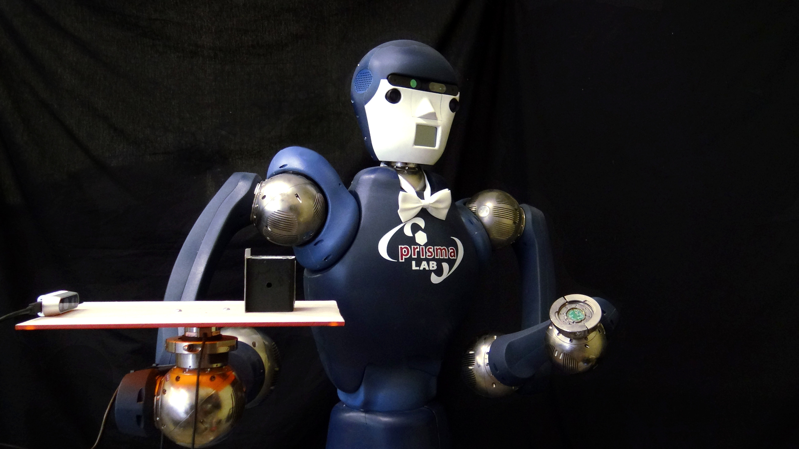
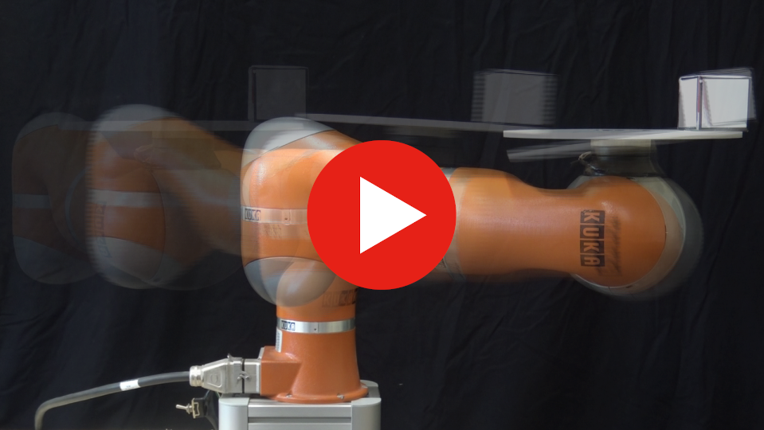

# Nonprehensile object transportation

Implementation of the nonprehensile object transportation method developed in the papers:

*[M. Selvaggio](http://wpage.unina.it/mario.selvaggio/index.html), [A. Garg](), [F. Ruggiero](http://www.fabioruggiero.name/web/index.php/en/), [G. Oriolo](http://www.diag.uniroma1.it/oriolo/), [B. Siciliano](http://wpage.unina.it/sicilian/) "Nonprehensile Object Transportation via Model Predictive Non-sliding Manipulation Control", in IEEE Transactions on Control System Technology, accepted, doi: 10.1109/TCST.2023.3277224.* 

Click [here](https://www.youtube.com/watch?v=H14NDnmpcNg) to watch the video.

[](https://www.youtube.com/watch?v=H14NDnmpcNg)

*[M. Selvaggio](http://wpage.unina.it/mario.selvaggio/index.html), [J. Cacace](http://wpage.unina.it/jonathan.cacace/), [C. Pacchierotti](https://team.inria.fr/rainbow/fr/team/claudio-pacchierotti/), [F. Ruggiero](http://www.fabioruggiero.name/web/index.php/en/), [P. Robuffo Giordano](https://team.inria.fr/rainbow/fr/team/prg/), "[A Shared-control Teleoperation Architecture for Nonprehensile Object Transportation](http://wpage.unina.it/mario.selvaggio/papers/tro2021.pdf)", in IEEE Transactions on Robotics, vol. 38, no. 1, pp. 569-583, Feb. 2022, doi: 10.1109/TRO.2021.3086773.* 

[](https://www.youtube.com/watch?v=5_eReIS7Ku4)

### Citing
```
@article{SelvaggioTRO2021,
  author={Selvaggio, Mario and Cacace, Jonathan and Pacchierotti, Claudio and Ruggiero, Fabio and Giordano, Paolo Robuffo},
  journal={IEEE Transactions on Robotics}, 
  title={A Shared-Control Teleoperation Architecture for Nonprehensile Object Transportation}, 
  year={2022},
  volume={38},
  number={1},
  pages={569-583},
  doi={10.1109/TRO.2021.3086773}
}
```

# Instructions

The code was tested with Ubuntu 20.04, and ROS Noetic. Different OS and ROS versions are possible but not supported.

### Install dependencies

`sudo apt-get install ros-noetic-ros-control ros-noetic-ros-controllers`

### Clone the following packages

```cd <CATKIN_WS_DIR>/src```

`git clone https://github.com/mrslvg/nonprehensile-object-transp.git`

`git clone https://github.com/ros/geometry.git`

`git clone https://github.com/ros/kdl_parser.git`

### Compile

`catkin_make --only-pkg-with-deps kdl_ros_control`

`catkin_make -DCATKIN_WHITELIST_PACKAGES=""`

### Run simulation

`roslaunch lbr_iiwa_launch lbr_iiwa_gazebo_effort_control.launch`

`rosrun nonprehensile-object-transp-iiwa nonprehensile-object-transp-iiwa_node`

Press play in gazebo to start the simulation
